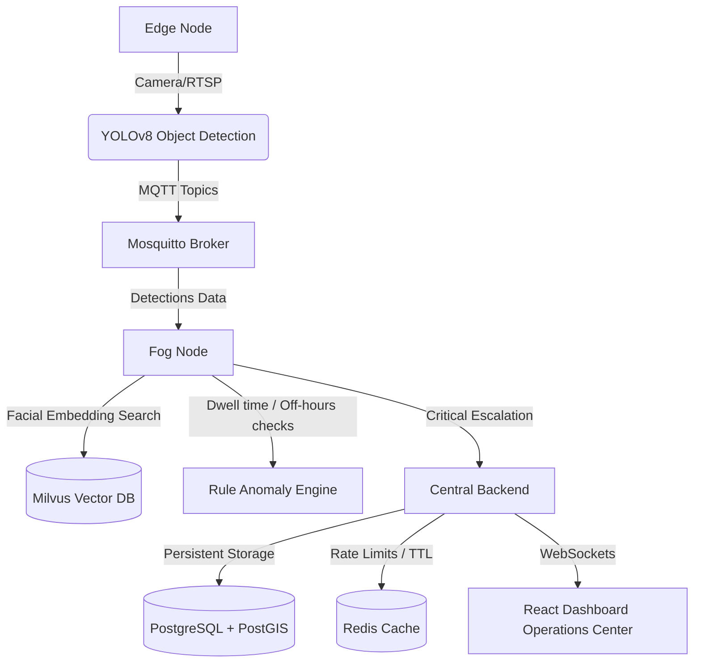

# AI Surveillance Platform (Edge -> Fog -> Central)

This repository contains the architecture, configurations, and baseline services for a 3-Tier AI Surveillance Platform. 



---

## Folder Structure

- **`/edge`**: Pulls video streams (RTSP/Webcam) using OpenCV, runs YOLOv8 Nano object detection, and publishes metadata to the MQTT broker.
- **`/fog`**: Subscribes to the edge topics. Generates 512-dimension face vectors for detected people, runs a vector database search via Milvus standalone to spot registered profiles (e.g. suspects or VIPs), analyzes loitering/off-hours anomalies, and escalates critical occurrences.
- **`/central`**: A FastAPI service storing geo-spatial alerts inside PostgreSQL (spatial geometry auto-calculated via triggers), managing alert rate-limiting and duplication throttles through Redis TTL cache, and broadcasting events using a WebSocket connections manager.
- **`/dashboard`**: A glassmorphic dark-theme React dashboard showcasing video overlay HUDs, historical/live alert lists, and a live spatial mapping tactical console.
- **`/infrastructure`**: Persistent volumes and configurations for third-party databases.

---

## Getting Started

### 1. Launch the Infrastructure Services
Deploy Mosquitto MQTT, PostgreSQL/PostGIS, Redis, Milvus, and Attu UI using Docker Compose:
```bash
docker compose up -d
```

### 2. Services Configuration
The default ports exposed to your local machine are:
- **MQTT Broker**: `localhost:1883`
- **PostgreSQL / PostGIS**: `localhost:5432`
- **Redis**: `localhost:6379`
- **Milvus Vector Database**: `localhost:19530`
- **Attu Milvus UI Manager**: `http://localhost:8000` (Use `http://milvus:19530` or `http://localhost:19530` to connect)
- **Central API Server**: `http://localhost:8000`
- **React Dashboard**: `http://localhost:3000`

---

## Local Microservices Execution

To run the pipeline services locally for testing:

1. Create a Python virtual environment and install dependencies:
   ```bash
   pip install -r requirements.txt
   ```

2. Start the **Central API Server**:
   ```bash
   cd central
   uvicorn main:app --host 0.0.0.0 --port 8000
   ```

3. Run the **Fog Inference Engine**:
   ```bash
   cd fog
   python main.py
   ```

4. Launch the **Edge Ingestion Node**:
   ```bash
   cd edge
   python main.py
   ```

5. Launch the **React Dashboard**:
   ```bash
   cd dashboard
   npm install
   npm run dev
   ```
